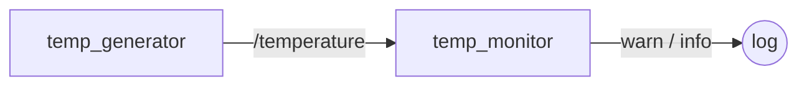

# `temp_monitor` package
ROS 2 python package.  [](https://docs.ros.org/en/humble/)

A package két node-ból áll. A `temp_generator` node szimulált hőmérséklet-adatokat generál, és ezeket egy `std_msgs/msg/Float32` típusú topicon (`/temperature`) hirdeti. A `temp_monitor` node erre a topicra feliratkozva figyeli a beérkező értékeket: ha azok a biztonságosnak tekintett 18–28°C tartományon kívül esnek, figyelmeztetést naplóz (`warn`), egyébként normál állapotot jelez (`info`).



## Packages and build

It is assumed that the workspace is `~/ros2_ws/`.

### Clone the packages
``` r
cd ~/ros2_ws/src
```
``` r
git clone https://github.com/itsmeshanky/sza_v56_temp_monitor
```

### Build ROS 2 packages
``` r
cd ~/ros2_ws
```
``` r
colcon build --packages-select temp_monitor --symlink-install
```

<details>
<summary> Don't forget to source before ROS commands.</summary>

``` bash
source ~/ros2_ws/install/setup.bash
```
</details>

``` r
ros2 launch temp_monitor launch_temp_monitor.launch.py
```
